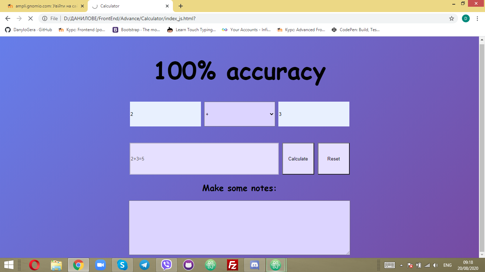

# The coolest calculator!
## Make calculations with 100% confidence!

## INSTRUCTION
 1. Enter the numbers in fields **_num1 and num2_**.
 2. Select the action to be performed in the field **_Choose_**.
 3. Click on the button **_Calculate_**.
 4. You will see the action performed in the field **_result_**
 5. If you want to clear all the fields click on the button **_Reset_**
 6. You can make some notes in the box below.

 If you enter something incorrectly in the field *result* will be "Error"
 

[ENJOY!](https://danylogera.github.io/Calculator/index_js.html)
